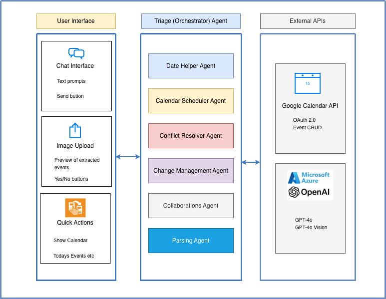
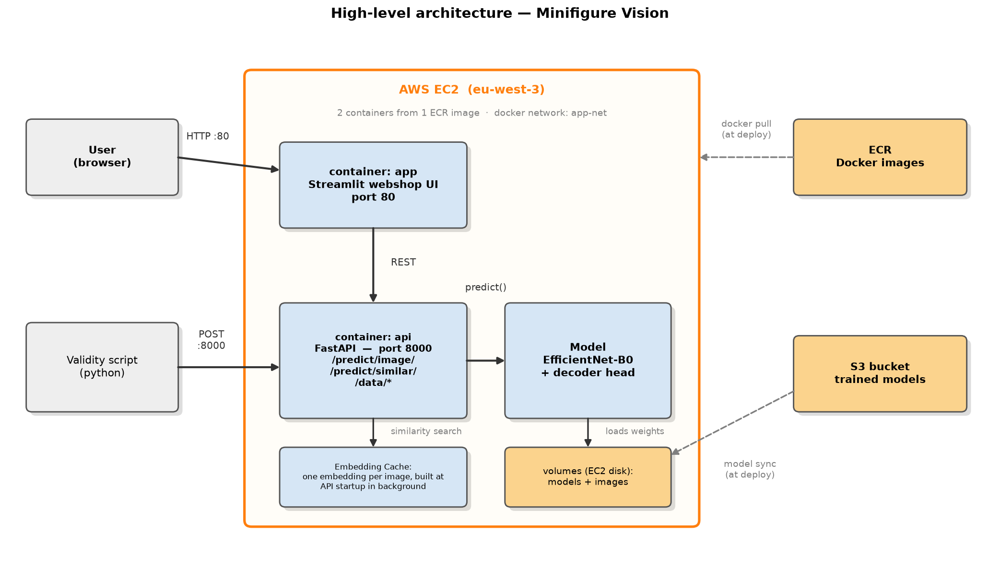
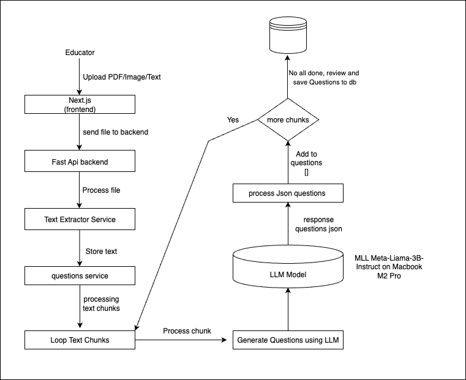
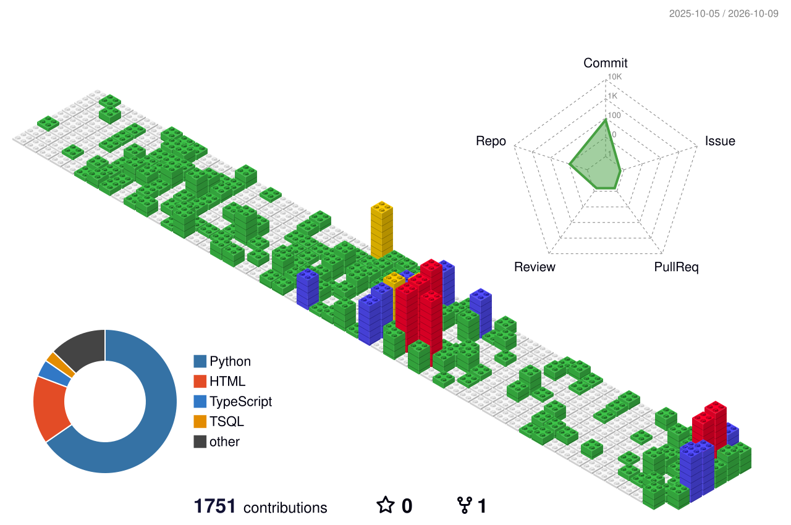

## Hi, I'm Muhammad Rafiq 👋

**Software Engineer (Backend, Data & AI)** in Ghent, Belgium · Master of AI, KU Leuven

I build data and AI systems end to end — from ingestion pipelines to the retrieval layer people actually talk to. Lately: turning unstructured enterprise knowledge into **knowledge graphs and RAG systems you can chat with**.

### 🚀 Featured projects

<table>
  <tr>
    <td width="50%" valign="top">
      <h4><a href="https://github.com/MRafiqAsim/tacitgraph">TacitGraph</a></h4>
      From PST to a knowledge graph you can chat with — an end-to-end RAG pipeline for Outlook archives.  
      GraphRAG · PathRAG · Vector + BM25 · ReAct agent 
      Ollama / Llama 3.1 · bge-m3 · Docker · fully local
    </td>
    <td width="50%" valign="top">
      <h4><a href="https://github.com/MRafiqAsim/tacitgraph-azure">TacitGraph · Azure</a></h4>
      The same pipeline at enterprise scale on Azure managed services.  
      Synapse · ADLS Gen2 · Cosmos DB (Gremlin) 
      Azure AI Search (HNSW + BM25) · Azure OpenAI · App Service
    </td>
  </tr>
</table>

  

<table>
  <tr>
    <td width="100%" valign="top">
      <h4><a href="https://github.com/MRafiqAsim/multi-agent-calendar">Multi-Agent Calendar Management System</a></h4>
      Manage Google Calendar through conversation — six AI agents, image-based event import and conflict resolution.  
      openai-agents · Azure OpenAI GPT-4o (+ Vision) · Google Calendar API · Gradio
    </td>
  </tr>
</table>

  

<table>
  <tr>
    <td width="100%" valign="top">
      <h4><a href="https://github.com/MRafiqAsim/MachineLearning_ComputerVision_ActiveLearning">Machine Learning (Computer Vision) and Active Learning</a></h4>
      An end-to-end computer vision product — multi-label image classification and visual similarity search, trained with an active-learning loop in Label Studio.  
      PyTorch (EfficientNet-B0) · Label Studio · FastAPI · Streamlit · Docker · Terraform on AWS · GitHub Actions
    </td>
  </tr>
</table>

  

<table>
  <tr>
    <td width="100%" valign="top">
      <h4><a href="https://github.com/MRafiqAsim/llm-question-bank">LLM-Powered Question Bank (POC)</a></h4>
      Generate exam questions from PDFs with large language models, reviewed by instructors before they reach the bank.  
      Llama 3 (MLX, Ollama) · OpenAI GPT · FastAPI · Next.js · MongoDB · Docker
    </td>
  </tr>
</table>

  

### 🧰 Toolbox

  

<table>
  <tr>
    <th width="25%">🧠 AI &amp; ML</th>
    <th width="25%">📊 Data</th>
    <th width="25%">☁️ Cloud &amp; DevOps</th>
    <th width="25%">⚙️ Backend</th>
  </tr>
  <tr>
    <td valign="top">RAG · GraphRAG · PathRAG Knowledge graphs ReAct agents · tool calling Azure OpenAI · Ollama · embeddings NLP — spaCy, Presidio Computer vision — PyTorch, EfficientNet Active learning · Label Studio Predictive modelling (XGBoost) · SHAP RAGAS evaluation</td>
    <td valign="top">ETL · medallion architecture Apache Airflow Snowflake · SQL Server PostgreSQL · MongoDB · Redis Synapse · ADLS Gen2 · Cosmos DB Azure AI Search</td>
    <td valign="top">AWS · Azure · GCP Docker · Terraform GitHub Actions (CI/CD) Monitoring (Datadog) Git</td>
    <td valign="top">Python (FastAPI, uv) Node.js · SQL REST APIs · microservices Event-driven messaging Unit tests · code review</td>
  </tr>
</table>

### 📈 A year of contributions

  

### 📫 Let's connect

  
  

  🟢 <b>Open to backend, data and AI engineering roles</b> · Ghent, Belgium · on-site, hybrid or remote

